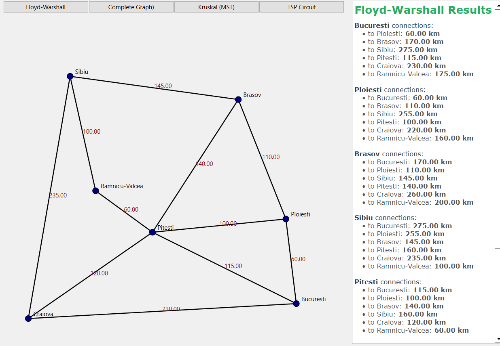
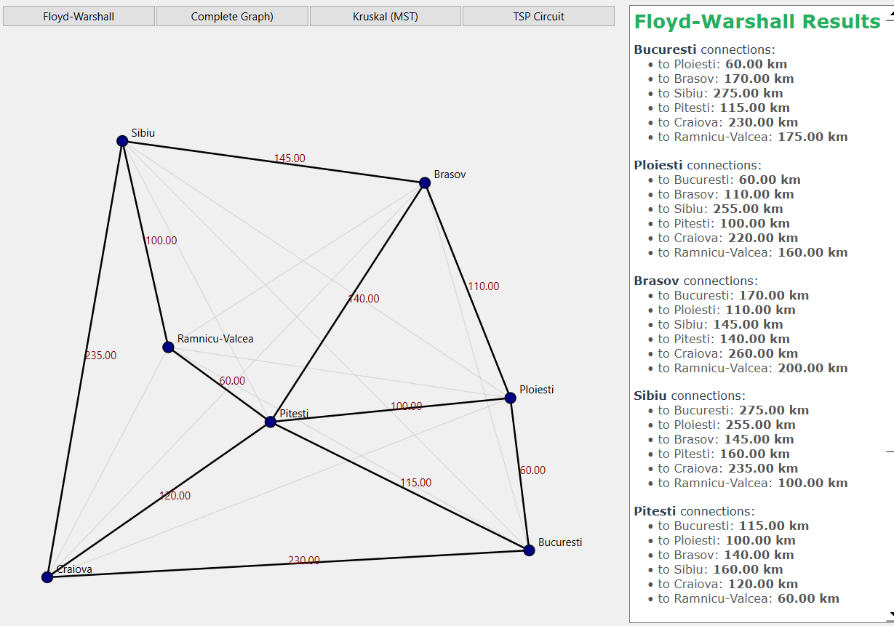
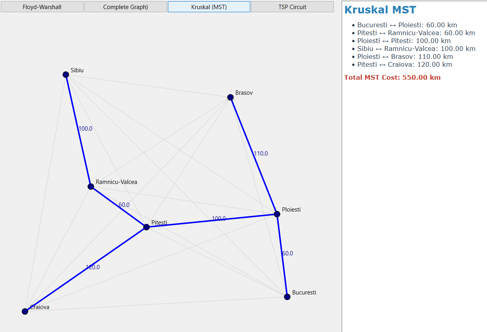
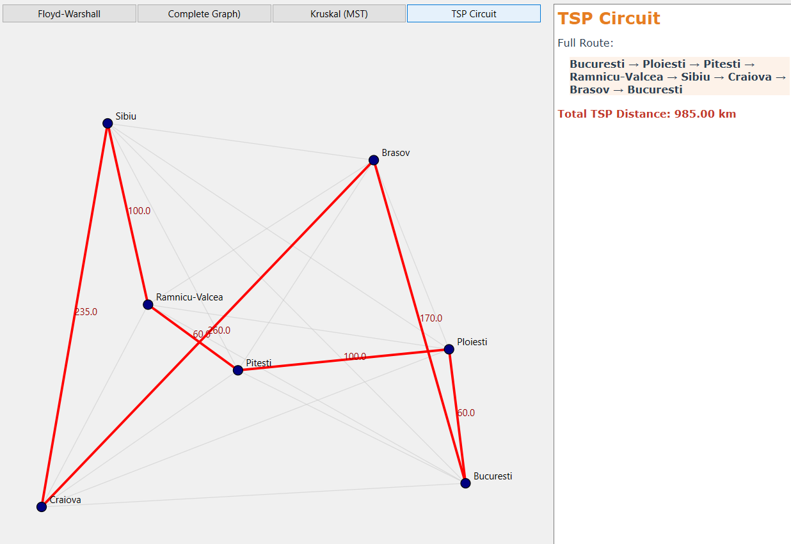

# Traveling Salesman Problem – Graph Algorithms Visualization

This project implements an approximate solution to the Traveling Salesman Problem (TSP) using classic graph algorithms and is developed in C++ with a graphical user interface built using the Qt framework.

The application loads a set of Romanian cities and constructs a complete weighted graph based on the distances between them. It computes shortest paths, generates a Minimum Spanning Tree, and produces an approximate TSP tour derived from the graph structure. The use of Qt enables interactive and clear visualization of the graph, making it easier to observe nodes, edges, and the resulting circuit.

---

## Features Overview

- Load cities, coordinates, and partial distances from a text file
- Automatically generate a **complete undirected graph (Kₙ)**
- Compute all-pairs shortest paths using **Floyd–Warshall**
- Build a **Minimum Spanning Tree (MST)** using **Kruskal + Union-Find**
- Generate an **approximate TSP solution** using preorder traversal of the MST
- Interactive graphical visualization using **Qt**
- Different display modes controlled via buttons

---

## Input Data

The input file contains:
- City names
- Geographic coordinates
- Distances between some pairs of cities

---

## Algorithms Implemented

### 1. Floyd–Warshall Algorithm
- Computes the shortest path between **all pairs of cities**
- Generates the distance matrix for the complete graph (Kₙ)
- Used as the base for MST and TSP computations

### 2. Minimum Spanning Tree (Kruskal)
- Efficient implementation using **Disjoint Set Union (Union–Find)**
- Produces a minimum-cost spanning tree over the complete graph

### 3. Approximate Traveling Salesman Solution
- Preorder traversal of the MST
- Starts from the first city
- Visits all cities once
- Returns to the starting city to form a circuit

This approach guarantees a valid approximation of the TSP solution.

---

## Graphical User Interface

The application provides four main interaction buttons:

### Floyd–Warshall
- Computes and displays all-pairs shortest paths
- Updates the distance matrix
- Shows detailed distance information in the side panel

---

### Complete Graph
- Displays the complete graph Kₙ
- Nodes are scaled according to their geographic coordinates
- Initial edges are highlighted

---

### Kruskal (MST)
- Displays the Minimum Spanning Tree
- MST edges are highlighted with a different color
- Total MST cost is displayed

 
---

### TSP Circuit
- Displays the approximate Traveling Salesman circuit
- Circuit edges are drawn in a distinct color
- The full route and total distance are shown

---

Developed as part of an academic assignment for graph algorithms.
